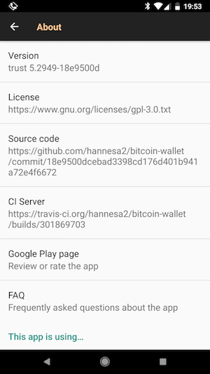

# Welcome

Welcome to ___trustable Bitcoin Wallet___, a standalone Bitcoin payment app for your Android device!

### Motivation

This is a fork of https://github.com/bitcoin-wallet/bitcoin-wallet . The _upstrem repos doesn't show right sha1_ in app, so we can't verify correct content of the App.
But this __essential__ for a opensource project, which need a lot of trust !

And I figured out on Version 5.38 of upstream in Play Store the git commit was not in repo, that means a different repo is used for build, and a possible other commit content can be used. __This is a no-go !__
 
I tried to clarify https://github.com/bitcoin-wallet/bitcoin-wallet/pull/459 but the only commiter in upstream repo doesn't want to write about and didn't want to help to build up more trust.

That's why I forked the repos and provide git sha1 in the app, and introduce a transparent build chain.

### Main Difference

 * Build with Android Studio 3

 * Show build job and last commit in about
 

# Upstream README

This project contains several sub-projects:

 * __wallet__:
     The Android app itself. This is probably what you're searching for.
 * __native-scrypt__:
     Native code implementation for Scrypt. The C files are copied from the
     Java Scrypt project at [GitHub](https://github.com/wg/scrypt).
 * __market__:
     App description and promo material for the Google Play app store.
 * __integration-android__:
     A tiny library for integrating Bitcoin payments into your own Android app
     (e.g. donations, in-app purchases).
 * __sample-integration-android__:
     A minimal example app to demonstrate integration of Bitcoin payments into
     your Android app.

You can build all sub-projects at once using Gradle:

`gradle clean build`
